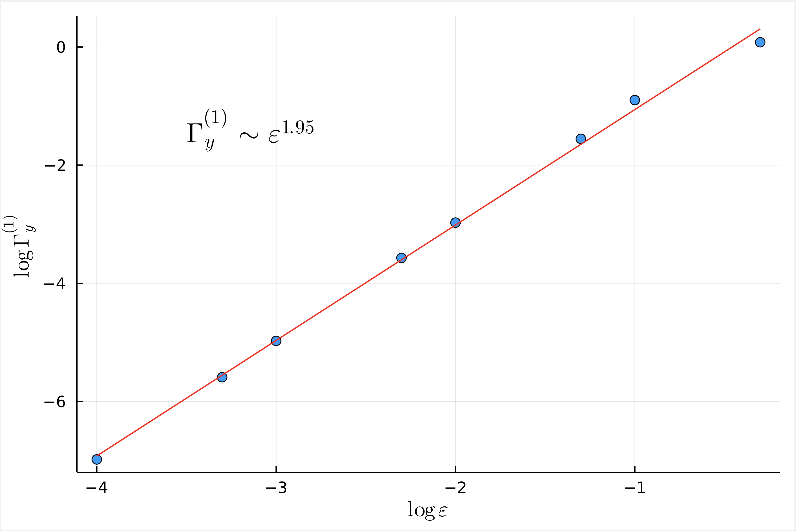
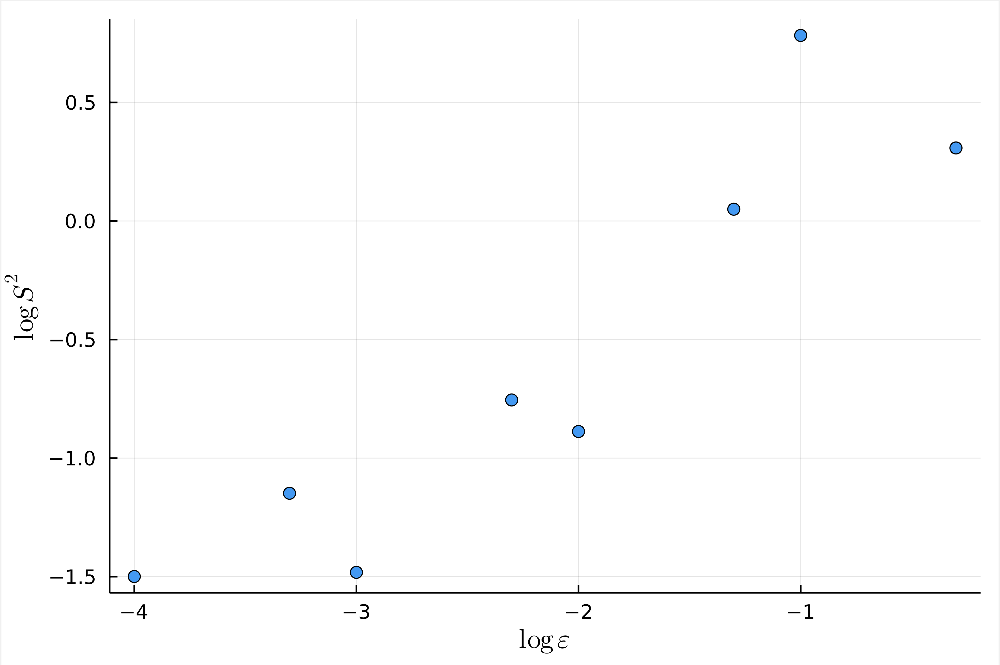

Numerical validation of the convergence of a small-noise SDE to the linearisation about the deterministic trajectory.

## File structure
The Julia files in the root directory serve the following purposes:

- `analysis.jl`:

- `benchmark.jl`:

- `covariance.jl`:

- `main.jl`:

- `models.jl`:

- `solve_sde.jl`:

## Example output
Average normed difference between SDE and linearisation realisations, for $r = 1,2,3,4$.

Histogram of SDE realisations with sample covariance and theoretical covariance bounds overlaid.

Absolute difference between the empirical and theoretical stochastic sensitivity.

